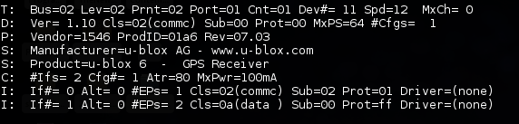
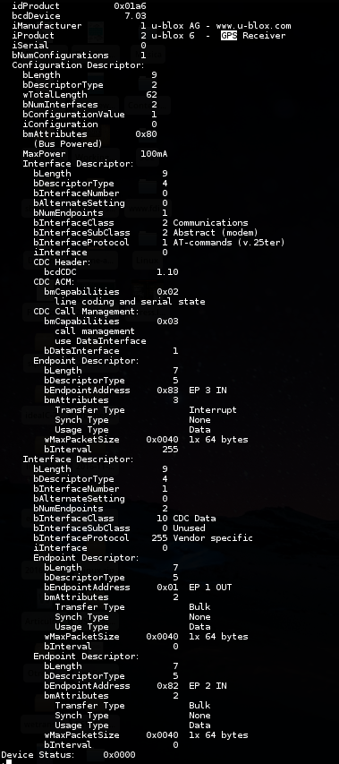
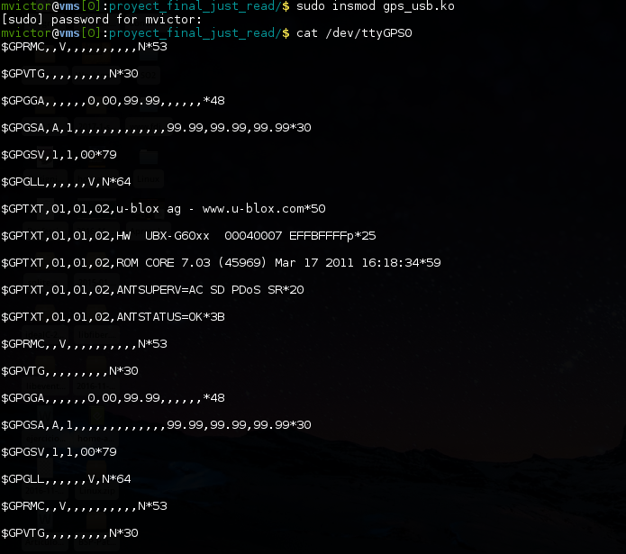

# Simple Device Driver

El device driver desarrollado esta basado en el driver cdc_acm el cual conecta
los subsistemas USB y TTY, lo mismo lo hace el device driver que se desarrollo.

Antes que nada el dispositivo que se uso para desarrollar el driver es el GPS
click de mikroelektronika https://shop.mikroe.com/click/wireless-connectivity/gps.

Ya que el codigo documenta un poco las funciones que se usaron, aqui se comentara
en general como funciona el driver y al final se mostraran las ligas que me ayudaron
a comprender mejor el funcionamiento.

Por un lado se tiene USB, como se vio en clase y lei en varios blogs, el protocolo
USB contiene configuraciones, dentro de estas interfaces y dentro de las interfaces
endpoints, en dispositivo tiene una configuracion, 2 interfaces una de control y la
otra de datos, la primera utiliza un protocolo en comandos AT y la otra es especifica
del productor. La interfaz de datos es la que nos interesa ya que por ella es por
donde se reciben las coordenadas, por ende el driver solamente se ocupa de esta
interfaz.

A continuacion se muestran 2 imagenes con la salida de los comandos usb-devices y
lsusb.

	Informacion del dispositivo GPS.

	Informacion del dispositivo GPS.

Los endpoints de la interfaz de datos son de tipo bulk y para poder recibir datos
del endpoint de entrada se registro un callback mediante un URB que una vez que el
dispositivo tiene datos para ser leidos se ejecuta la funcion callback y se reciben
los datos.

En general es todo lo que se necesita del lado de USB, en el otro extremo tenemos
el subsistema tty, que simplemente registra los URBs una vez que se ha abierto el
nodo creado en /dev, y una vez registrados los callbacks empiezan a ser llamado
y se reciben los datos enviados por el GPS, estos se pasan al metodo read que se
ejecuta cuando se hace un cat y se pueden obtener los datos.

En rasgos generales es lo que se hace para que pueda funcionar este sencillo device
driver.

En la siguiente imagen se muestra la salida de un cat sobre el nodo creado.

	Salida del nodo creado cuando se conecta el GPS.

En la siguiente lista se muestran algunos recursos consultados.

* Linux Source Code v4.8 (En especial cdc_acm.c)
* Linux device drivers series. http://opensourceforu.com/tag/linux-device-drivers-series/
* ̉̉Writing a Linux Kernel Driver for an Unknown USB Device. http://matthias.vallentin.net/blog/2007/04/writing-a-linux-kernel-driver-for-an-unknown-usb-device/
* LDD3 Chapter 18. https://static.lwn.net/images/pdf/LDD3/ch18.pdf
* Serial Drivers. http://www.linux.it/~rubini/docs/serial/serial.html
* Essential Linux Device Drivers. http://www.embeddedlinux.org.cn/essentiallinuxdevicedrivers/final/ch06lev1sec1.html 
* Writing a USB Driver. http://www.makelinux.net/ldd3/chp-13-sect-4.
* ...
