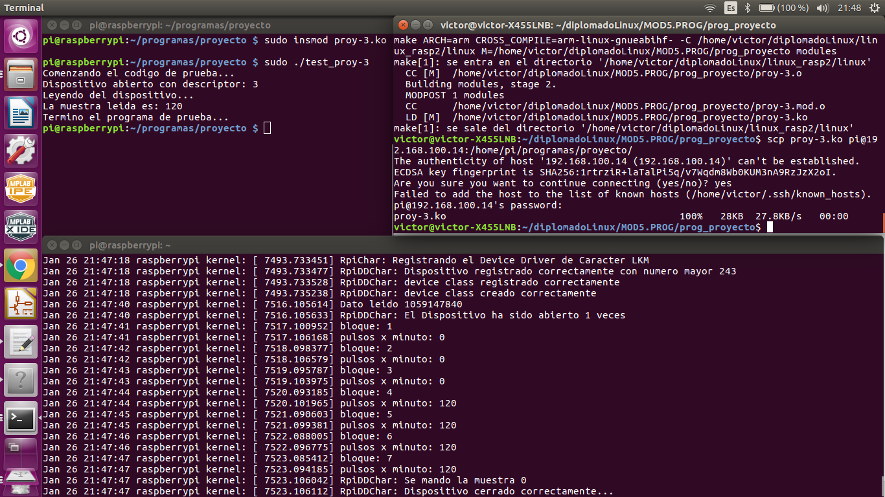

# Proyecto final

## Creacion de un Device Driver de Caracter

El presente proyecto crea un Device Driver de Caracter para calcular la frecuencia cardiaca obtenida con un 
sensor de la compañia pulse sensor. Este proyecto de crea progresivamente en 3 versiones, las cuales se 
explican a continuacion: 

1. Primer version

En esta version se configura el UART a bajo nivel. Para hacer esta configuracion se accesa a los registros 
fisicos del UART mediante las direcciones virtuales generadas por la MMU. Estas direcciones se obtienen con 
la funcion ioremap desde el espacio de kernel. Ademas se utiliza el sistema de interrupciones para la captura
de datos.

2. Segunda version

En esta version se agregan las funciones, callbacks, para el manejo del devide driver de caracter, asi como
su inicializacion. Ademas se agrega el codigo de la primer version. 

3. Tercera version

En esta version se agrega un buffer circular de 4096 muestras en la ISR y el codigo de procesamiento de la señal 
de pulso cardiaco en un tasklet. El procesamiento consiste en la aplicacion de una ventana hamming en formato
Q15 y de la funcion de autocorrelacion.

Alumnos: 
Victor Hugo Garcia Ortega
Ricardo Balderas Paredes

.

